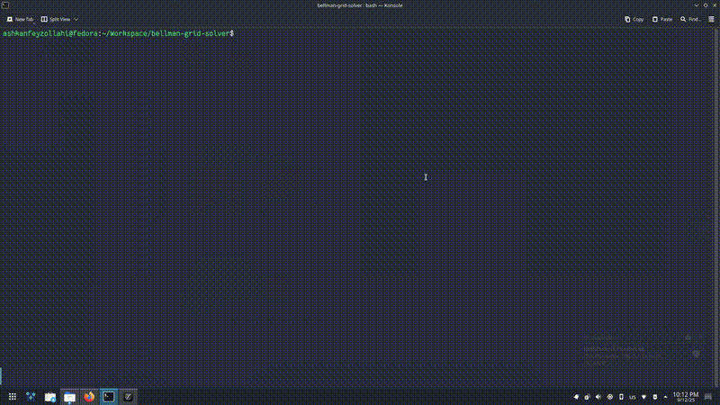

# Bellman Grid Solver



<p align="center">
    <em>🤖 Solve deterministic grid worlds/mazes using bellman equation</em>
</p>

**bellman-grid-solver** is a simple Python project that demonstrates how to solve a grid world using bellman equation (with recursion). This project implements *a deterministic grid world environment*, *a deterministic grid world agent using bellman equation*, *a pygame-based learning process visualizer* and *a simulator for combining all these three*. This project was written for educational purposes, created while learning the basics of reinforcement learning.

## Usage

### Setup with Poetry

This project uses [Poetry](https://python-poetry.org/) to manage dependencies and virtual environments.

1. **Install Poetry** (if you don’t have it already):

```bash
curl -sSL https://install.python-poetry.org | python3 -
```

or follow the instructions on the [official Poetry site](https://python-poetry.org/docs/#installation).

2. **Clone this repository** (or download the code):

```bash
git clone https://github.com/ashkanfeyzollahi/bellman-grid-solver.git
cd bellman-grid-solver
```

3. **Install dependencies and create a virtual environment:**

```bash
poetry install
```

This will create a virtual environment and install the needed packages.

4. **Run the script:**

```bash
poetry run python bellman-grid-solver
```

You should see a **PyGame** window showing grid solving process.
